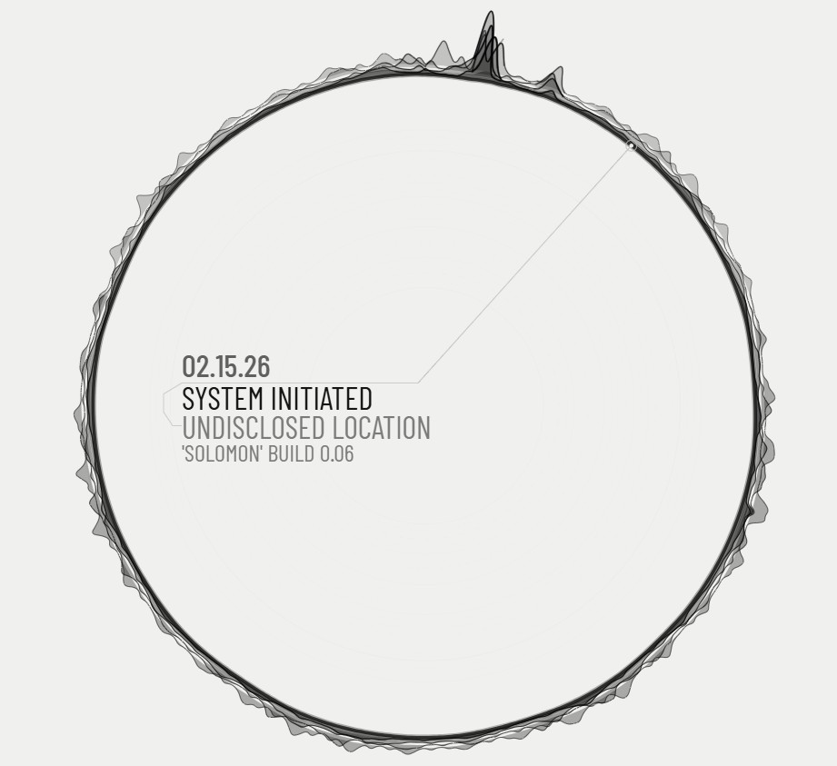

# Rehoboam UI

A pnpm monorepo with a Rehoboam-style React UI, a Cloudflare Worker API, and a scheduled Cloudflare Worker jobs service.



- Explore a timeline of major world events with Rehoboam-style animation.
- Inspect active signals through synchronized callouts.

## Tech Stack

- React 19
- Vite 8
- TypeScript 7 (native `tsc`)
- oxlint (type-aware)
- Prettier 3
- Vitest 5
- pnpm 11 + Turborepo

## Requirements

- Node.js `24.21.0` (see `.nvmrc`)
- pnpm `11+` (pinned via `packageManager`; `corepack enable` picks it up)

## Local Development

```bash
pnpm install
pnpm dev
```

`pnpm dev` runs all workspaces in parallel:

- Web UI: `http://localhost:3000`
- API Worker: `http://localhost:3001`
- Events endpoint: `http://localhost:3001/api/events`
- Jobs Worker (scheduled): `http://localhost:3002`
- Scheduled test trigger: `http://localhost:3002/__scheduled?cron=0+*/6+*+*+*`

In local web development, Vite proxies `/api/*` requests from `apps/ui` to the
API worker on port `3001`.

## Build and Preview

```bash
pnpm build
pnpm --filter rehoboam-ui preview
```

Optional bundle analysis (starts the analyzer server and does not exit on its
own):

```bash
pnpm --filter rehoboam-ui bundle:analyze
```

## Quality Checks

```bash
pnpm typecheck
pnpm lint
pnpm format:check
pnpm test
```

## Playwright Screenshots

Use the local screenshot tool for fast UI iteration snapshots:

```bash
pnpm --filter rehoboam-ui screenshot:scene
```

Default outputs:

- full page: `apps/ui/.tmp/screenshots/current-codex-auto.png`
- scene element: `apps/ui/.tmp/screenshots/current-codex-auto.instrument.png`

Useful options:

```bash
pnpm --filter rehoboam-ui screenshot:scene --output .tmp/screenshots/current-codex-auto.png
pnpm --filter rehoboam-ui screenshot:scene --width 1365 --height 1024 --settle-ms 250
pnpm --filter rehoboam-ui screenshot:scene --base-url http://127.0.0.1:3000
pnpm --filter rehoboam-ui screenshot:scene:headed
```

Equivalent environment variables:

- `SCREENSHOT_OUTPUT_BASE`
- `SCREENSHOT_VIEWPORT_WIDTH`
- `SCREENSHOT_VIEWPORT_HEIGHT`
- `SCREENSHOT_SETTLE_MS`
- `SCREENSHOT_BASE_URL`
- `SCREENSHOT_HEADLESS`

The command starts a dedicated web screenshot server on port `3000` and an API
worker on port `3001` by default, waits for `.rehoboam-scene__instrument` to
be visible, and then applies a short settle delay before capturing.

## Updating Packages

### Pick packages to update

1. `pnpm outdated -r`
2. `pnpm up --latest -r package another-package`

Versions shared by more than one workspace live in the `catalog:` section of
`pnpm-workspace.yaml`; manifests reference them as `"catalog:"`. `pnpm up`
rewrites the catalog entry, so `git diff pnpm-workspace.yaml` shows every
shared bump. New releases are only resolvable after 14 days
(`minimumReleaseAge`).

## Scripts

- `pnpm dev` - run `dev` in all workspaces (`web` + `api` + `jobs`) through Turborepo
- `pnpm build` - build all workspaces (cached by Turborepo)
- `pnpm typecheck` - run TypeScript checks in all workspaces (cached by Turborepo)
- `pnpm lint` - run type-aware oxlint across the repo (`.oxlintrc.json`)
- `pnpm format` - auto-format files with Prettier
- `pnpm format:check` - verify formatting
- `pnpm test` - run tests in all workspaces (cached by Turborepo)
- `pnpm clean` - remove each workspace's `.turbo`, caches, build output and `node_modules` (the root `node_modules` is kept)
- `pnpm --filter rehoboam-ui dev` - run only the web dev server (`http://localhost:3000`)
- `pnpm --filter rehoboam-api dev` - run only the API worker (`http://localhost:3001`)
- `pnpm --filter rehoboam-jobs dev` - run only the jobs worker with scheduled testing (`http://localhost:3002`)
- `pnpm --filter rehoboam-ui preview` - preview the web production build
- `pnpm --filter rehoboam-ui bundle:analyze` - launch `vite-bundle-analyzer` for the UI build
- `pnpm --filter rehoboam-ui screenshot:scene` - capture deterministic full + scene screenshots
- `pnpm --filter rehoboam-ui screenshot:scene:headed` - run screenshot capture with headed browser

## CI Pipeline

Two GitHub Actions workflows validate every code change:

- `.github/workflows/feature.yml`: runs on pull requests to `main`
- `.github/workflows/main.yml`: runs on pushes to `main`

Both workflows run:

- typecheck
- lint
- `format:check`
- test

On pushes to `main`, `.github/workflows/main.yml` also applies Jobs D1 migrations
before deploying the API and Jobs workers.

Manual operations workflow:

- `.github/workflows/migrations.yml`: manually applies Jobs D1 migrations to production for retries/backfills (`workflow_dispatch`, environment-gated)
