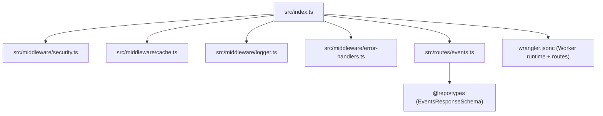

# Rehoboam API

Cloudflare Worker API workspace for timeline events consumed by `apps/ui`.

## Endpoint Contract

- `GET /api/events`
- Response body is validated with `EventsResponseSchema` from `@repo/types`

```json
[
  {
    "id": "dotcom-bubble-burst",
    "date": "2000-03-10",
    "title": "Dot-com bubble burst",
    "location": "New York",
    "severity": "high"
  }
]
```

`severity` is one of `low | medium | high | critical`.

## Request Lifecycle

```mermaid
flowchart LR
    Client["Client (apps/ui or external)"] --> Worker["Hono App (src/index.ts)"]
    Worker --> SH["secureHeadersMiddleware"]
    SH --> CORS["corsMiddleware"]
    CORS --> LOG["loggerMiddleware (X-Request-Id set after response)"]
    LOG --> ETAG["etagMiddleware (weak ETags)"]
    ETAG --> NOSTORE["defaultNoStoreCacheControlMiddleware"]
    NOSTORE --> CACHE["createCacheMiddleware (300s, Vary: Origin)"]
    CACHE --> ROUTE["Route: /api/events"]
    ROUTE --> HANDLER["events.ts handler"]
    HANDLER --> SCHEMA["EventsResponseSchema.parse(mockEvents)"]
    SCHEMA --> RESP["JSON 200 response"]

    ROUTE -. unmatched .-> NF["notFoundHandler (404)"]
    HANDLER -. throws .-> ERR["onErrorHandler (500)"]
```



## Workspace Architecture



## Local Development

Run from repo root:

```bash
pnpm --filter rehoboam-api dev
```

Default local URL: `http://localhost:3001`

For full-stack local dev (`apps/ui` + `apps/api` in parallel), run:

```bash
pnpm dev
```

`apps/ui` proxies `/api/*` to `http://localhost:3001` in local development.

## Workspace Scripts

- `pnpm --filter rehoboam-api dev` - start Wrangler local worker on port `3001`
- `pnpm --filter rehoboam-api start` - start Wrangler local worker with Wrangler defaults
- `pnpm --filter rehoboam-api deploy` - deploy Worker
- `pnpm --filter rehoboam-api cf-typegen` - generate `worker-configuration.d.ts`
- `pnpm --filter rehoboam-api typecheck` - run TypeScript checks
- `pnpm --filter rehoboam-api lint` - run ESLint
- `pnpm --filter rehoboam-api test` - run Vitest

## Project Structure

- Worker entry + middleware composition: `src/index.ts`
- Events route: `src/routes/events.ts`
- Security middleware: `src/middleware/security.ts`
- Cache middleware (ETag, Cloudflare Cache API, default no-store): `src/middleware/cache.ts`
- Request logger middleware: `src/middleware/logger.ts`
- Error + not-found handlers: `src/middleware/error-handlers.ts`
- Worker config and route deployment: `wrangler.jsonc`
