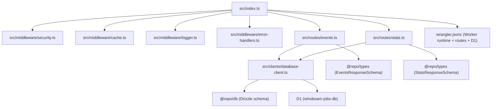

# Rehoboam API

Cloudflare Worker API workspace for public timeline and stats endpoints consumed by `apps/ui` and other clients.

## Endpoint Contracts

- `GET /api/events`
- `GET /api/stats`
- Response bodies are validated with `EventsResponseSchema` and `StatsResponseSchema` from `@repo/types`
- The API prefers processed `events`; if the `events` table is still empty, it falls back to recent `news_items` mapped into the same response shape

```json
[
  {
    "id": "dotcom-bubble-burst",
    "date": "2000-03-10",
    "title": "Dot-com bubble burst",
    "location": "New York, US",
    "severity": "high",
    "category": "economy"
  }
]
```

`severity` is one of `low | medium | high | critical`.
`category` is one of `conflict | politics | climate | health | economy | diplomacy | disaster | science | general`.

`GET /api/stats` returns aggregate metrics for non-skipped events:

```json
{
  "totals": {
    "events": 42
  },
  "byCategory": {
    "conflict": 8,
    "politics": 10,
    "climate": 2,
    "health": 1,
    "economy": 7,
    "diplomacy": 3,
    "disaster": 5,
    "science": 1,
    "general": 5
  },
  "bySeverity": {
    "low": 8,
    "medium": 20,
    "high": 11,
    "critical": 3
  },
  "recentActivity": [
    { "date": "2025-01-01", "count": 5 },
    { "date": "2025-01-02", "count": 7 }
  ]
}
```

## Request Lifecycle

```mermaid
flowchart LR
    Client["Client (apps/ui or external)"] --> Worker["Hono App (src/index.ts)"]
    Worker --> SH["secureHeadersMiddleware"]
    SH --> CORS["corsMiddleware"]
    CORS --> LOG["loggerMiddleware (X-Request-Id set after response)"]
    LOG --> ETAG["etagMiddleware (weak ETags)"]
    ETAG --> NOSTORE["defaultNoStoreCacheControlMiddleware"]
    NOSTORE --> EVENTS_CACHE["events cache (300s, Vary: Origin)"]
    NOSTORE --> STATS_CACHE["stats cache (600s, Vary: Origin)"]
    EVENTS_CACHE --> EVENTS_ROUTE["Route: /api/events"]
    STATS_CACHE --> STATS_ROUTE["Route: /api/stats"]
    EVENTS_ROUTE --> EVENTS_HANDLER["events.ts handler"]
    STATS_ROUTE --> STATS_HANDLER["stats.ts handler"]
    EVENTS_HANDLER --> EVENTS_DB["DatabaseClient.getEvents() (D1, max 50)"]
    STATS_HANDLER --> STATS_DB["DatabaseClient.getStats()"]
    EVENTS_DB --> EVENTS_SCHEMA["EventsResponseSchema.parse(events)"]
    STATS_DB --> STATS_SCHEMA["StatsResponseSchema.parse(stats)"]
    EVENTS_SCHEMA --> RESP["JSON 200 response"]
    STATS_SCHEMA --> RESP

    EVENTS_ROUTE -. unmatched .-> NF["notFoundHandler (404)"]
    STATS_ROUTE -. unmatched .-> NF
    EVENTS_HANDLER -. throws .-> ERR["onErrorHandler (500)"]
    STATS_HANDLER -. throws .-> ERR
```



## Workspace Architecture



## Local Development

Run from repo root:

```bash
pnpm --filter rehoboam-api dev
```

Default local URL: `http://localhost:3001`

For full-stack local dev (`apps/ui` + `apps/api` in parallel), run:

```bash
pnpm dev
```

`apps/ui` proxies `/api/*` to `http://localhost:3001` in local development.

## Workspace Scripts

- `pnpm --filter rehoboam-api dev` - start Wrangler local worker on port `3001`
- `pnpm --filter rehoboam-api start` - start Wrangler local worker with Wrangler defaults
- `pnpm --filter rehoboam-api deploy` - deploy Worker
- `pnpm --filter rehoboam-api cf-typegen` - generate `worker-configuration.d.ts`
- `pnpm --filter rehoboam-api typecheck` - run TypeScript checks
- `pnpm --filter rehoboam-api lint` - run ESLint
- `pnpm --filter rehoboam-api test` - run Vitest

## Project Structure

- Worker entry + middleware composition: `src/index.ts`
- Events route: `src/routes/events.ts`
- Stats route: `src/routes/stats.ts`
- Database client (Drizzle ORM, D1): `src/clients/database-client.ts`
- Security middleware: `src/middleware/security.ts`
- Cache middleware (ETag, Cloudflare Cache API, default no-store): `src/middleware/cache.ts`
- Request logger middleware: `src/middleware/logger.ts`
- Error + not-found handlers: `src/middleware/error-handlers.ts`
- Worker config, route deployment, and D1 binding: `wrangler.jsonc`
