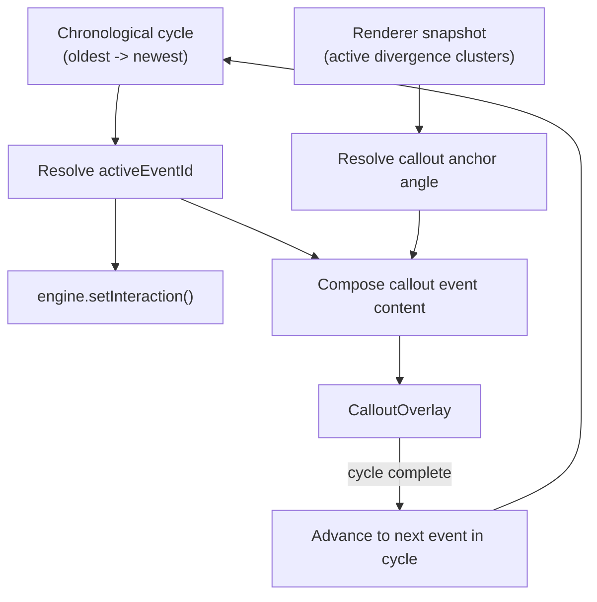

# Rehoboam Codex - Architecture

Real-time animated timeline visualization built with React 19 and Canvas 2D.
Events are rendered as distortions in a polar coordinate system, with overlays
for focused event detail.

This document reflects the implementation currently in this repository and was
verified against source on February 11, 2026.

## Current Status Snapshot

- Active implementation is V2 under `apps/web/src/features/rehoboam/**`.
- Active renderer pipeline has four passes: background, rings, divergence, sweep.
- `apps/web/src/features/rehoboam/render/canvas2d/passes/event-contour-pass.ts` exists but
  is not wired into `Renderer2D`.
- Scene boot is cache-first from IndexedDB, then background refresh/replace from a
  static mock source.
- Automated tests are present under `apps/web/src/tests/rehoboam/**` for data, layout,
  engine, renderer, overlay, and quality behavior.

## Tech Stack

| Layer           | Technology                                              |
| --------------- | ------------------------------------------------------- |
| UI framework    | React 19 (`react`/`react-dom` 19.2.4)                   |
| Build tool      | Vite 7 (`vite` 7.3.1)                                   |
| Language        | TypeScript 5 (strict mode)                              |
| Package manager | pnpm 10                                                 |
| Tests           | Vitest 4 (unit) + Playwright 1.58 (e2e screenshot flow) |
| Styling         | CSS custom properties + fluid `clamp()` typography      |

---

## System Architecture


---

## Render Pipeline

Every frame, `RehoboamEngine` calls `Renderer2D.render()`. The active pass order
is fixed and all passes draw on the same Canvas 2D context.


| #   | Pass           | What it draws                                                                                                                                                                                                                                                                                           |
| --- | -------------- | ------------------------------------------------------------------------------------------------------------------------------------------------------------------------------------------------------------------------------------------------------------------------------------------------------- |
| 1   | **Background** | Full scene fill, subtle center ring stroke, and soft core tint                                                                                                                                                                                                                                          |
| 2   | **Rings**      | Seeded concentric rings with deterministic dash templates and per-ring rotation/pulse                                                                                                                                                                                                                   |
| 3   | **Divergence** | Main contour deformation field. Uses theme sample count (220/300/360 by quality tier), event pulses, cluster extensions with outward lift caps and inward notch phases, localized spike-burst envelopes, a core-seam underpaint gradient bridge, and multi-layer mountain lanes with sector smoke halos |
| 4   | **Sweep**      | Scanner arc (6 degrees wide, alpha 0.06). Tracks pointer angle when present, else rotates at theme speed (default 8 degrees/s)                                                                                                                                                                          |

`event-contour-pass.ts` is currently dormant and not invoked by `renderer-2d.ts`.

### Trackers

**Pulse tracker (`divergence-pulse-tracker.ts`)**

- Event revision signature uses: revision time (`updatedAtMs` or `createdAtMs` or `timestampMs`) + `timestampMs` + `severity` + `title` + `category`.
- Emits pulses on new/changed revisions with envelope constants:
  - attack: `120ms`
  - decay: `1400ms`
  - lifetime: `1520ms`
- Keeps at most `64` active pulses; divergence pass renders up to `14` pulses per frame after strength prioritization (with interaction-weight boost).
- Initial non-empty snapshot does not emit pulses by default (`emitInitialPulses` is false).

**Cluster tracker (`divergence-cluster-tracker.ts`)**

- Ambient procedural distortion independent of event updates.
- Default active range is `3-4` clusters (`minActiveClusters=3`, `maxActiveClusters=4`).
- Severity archetype spawn weights are:
  - medium: `52%`
  - high: `34%`
  - critical: `14%`
- Clusters include attack/hold/decay envelopes, drift, flare modulation, and spike sub-shapes.
- RNG is seeded. With default options the seed includes `Date.now()`/`Math.random()`, so behavior is stable within a run but not deterministic across sessions.

---

## Data Flow

### Boot Sequence (cache-first)


Behavior:

- IndexedDB read failures return `[]` (best-effort persistence).
- Source refresh failures return existing snapshot unchanged.
- Successful refresh treats source as authoritative and replaces cached snapshot.
- Current scene source is `createMockEventSource()` backed by
  `apps/web/src/features/rehoboam/fixtures/mock-events.json`.

### Normalization and Dedupe Pipeline

`runEventPipeline(input)` behavior:

1. If `input` is already `WorldEvent[]`-like: skip normalize and run dedupe.
2. Otherwise:
   - normalize flexible field names (`title|headline|name`, `timestamp|publishedAt|createdAt|date`, etc.)
   - derive stable `id` using FNV-1a hash over raw ID or normalized fingerprint
   - sort events
   - dedupe in two passes:
     - by exact `id`
     - by semantic key (`title|category|30-minute bucket`)

### WorldEvent Type

```typescript
{
  id: string
  title: string
  timestampMs: number
  severity: "low" | "medium" | "high" | "critical"
  category: string
  summary?: string
  location?: { label: string, latitude: number, longitude: number }
  createdAtMs?: number
  updatedAtMs?: number
}
```

---

## Interaction Flow



Priority resolution for `activeEventId`:

1. chronological cycle event (`timestampMs` asc, `id` asc tie-breaker)
2. fallback to oldest visible event (`timestampMs` asc, `id` asc)

---

## Scene Composition

`RehoboamScene` is the top-level orchestrator. It owns state and syncs:

- engine state (`setEvents`, `setInteraction`, `setTheme`, `resize`)
- overlay props (`CalloutOverlay`, `EventListPanel`)

```tsx
<main className="rehoboam-scene">
  <div className="rehoboam-scene__layout">
    <section className="rehoboam-scene__instrument">
      <canvas className="rehoboam-scene__canvas" />
      <CalloutOverlay />
    </section>
    <EventListPanel />
  </div>
</main>
```

### Quality Tiering

Resolved by viewport and capability (`hardwareConcurrency`, `deviceMemoryGiB`):

| Tier   | Ring Count | Divergence Samples | Trigger                                                                                     |
| ------ | ---------- | ------------------ | ------------------------------------------------------------------------------------------- |
| Low    | 14         | 220                | `shortestSide <= 520` OR `area <= 340000` OR (constrained device AND `shortestSide <= 700`) |
| Medium | 18         | 300                | `shortestSide <= 780` OR `area <= 520000` OR constrained device                             |
| High   | 22         | 360                | all other cases                                                                             |

Constrained device means CPU cores `<= 4` or memory `<= 4 GiB`.

### Event Layout

Current scene layout choices:

- `computeAngles(..., { distributionMode: "ordered", maxVisibleCount: 48 })`
- `nowMs` anchor is latest event timestamp + `45 minutes`
- marker hit radius is at least `24px`

`compute-angles.ts` also supports:

- `time-window` mapping over a configurable window (default 24h)
- `adaptive` mode (switches to ordered when timestamp span ratio is below 0.35)

When markers exceed `maxVisibleCount`, clustering uses angular buckets of
`TAU / maxVisibleCount`; representative selection is severity desc, timestamp
desc, then id asc.

---

## Engine

The engine bridges React state and imperative RAF rendering.

```text
createRehoboamEngine(options)
  state: events, interaction, theme, viewport
  renderer: RehoboamRenderer (Renderer2D by default)
  rafLoop: monotonic clock + start/stop loop
  API:
    start()
    stop()
    resize(size)
    setEvents(events)
    setInteraction(interaction)
    setTheme(theme)
    destroy()
```

Setter behavior:

- While RAF is running: setters update state used on the next frame.
- While RAF is stopped: setters trigger an immediate snapshot render (`renderSnapshot()`).

### Theme

```typescript
{
  backgroundColor: "#efefed";
  backgroundCoreColor: "#fbfbf9";
  ringColor: "#1f1f1f";
  sweepColor: "#303030";
  ringSeed: "rehoboam-v2-rings";
  ringCount: 22;
  divergenceSampleCount: 360;
  sweepSpeedDegPerSecond: 8;
}
```

---

## Overlay System

### CalloutOverlay

Animated active-event callout:

- startup plays a one-time centered boot callout (`IntroCalloutOverlay`) before
  regular event cycling starts
- startup callout supports `?intro-debug=1` (locked visible), while any
  `callout-debug*` query skips intro entirely
- startup callout now mirrors regular callout lifecycle: open, hold, then
  reverse close before advancing to regular event cycling
- V1-style SVG leader with two strokes:
  - connector line: anchor -> label dock point
  - framed polyline near the label edge with a beveled notch
- anchor angle is sourced from active divergence clusters (randomized per cycle)
- two anchor nodes (outer + inner)
- label block placement follows V1 quadrant rules (left/right + top/bottom bands)
- label fields follow V1 block semantics:
  - date/time (`HH.MM.SS`)
  - location/category headline (dynamic size based on length)
  - message/title line
  - add/summary line (fallback `severity / category`)
- animations are `react-spring`-driven with V1-style staging:
  - line/frame share one dash-offset spring (`-1800 -> 0`) with `1000ms` delay and `1000ms` duration
  - text enters after `2000ms` with spring config (`mass=3`, `tension=600`, `friction=100`)
  - overlay auto-closes after `5000ms` and uses reverse values for close
  - active callout target is latched for the full open/close cycle
  - callout anchor angle is picked from active divergence clusters on each cycle
  - after close completes, scene advances to the next chronological event target

### EventListPanel

Event list UI:

- sorted by severity desc, timestamp desc, id asc
- keyboard listbox behavior: arrows, Home/End, Escape
- click or keyboard selection updates `selectedEventId`
- shows cluster suffix when representative item stands for multiple event IDs

---

## Shared Utilities

### Seeded RNG (`apps/web/src/shared/utils/seeded-rng.ts`)

FNV-1a seed hashing + Mulberry32 PRNG, used by ring and cluster generation.

### Polar Math (`apps/web/src/features/rehoboam/layout/polar.ts`)

`polarToCartesian`, `cartesianToPolar`, `normalizeAngle`, and
`shortestAngularDistance` are the geometry primitives for layout and rendering.

---

## Testing Coverage

Current test modules under `apps/web/src/tests/rehoboam/**` cover:

- data pipeline (`source`, `normalize`, `dedupe`, `bootstrap`, `persistence`)
- layout math (`polar`, `compute-angles`, `seeded-rng`)
- engine/input (`rehoboam-engine`, `input`)
- renderer behavior (`renderer-2d`, `divergence-pass`, `divergence-pulse-tracker`)
- overlay logic (`event-list-panel`)
- quality profile resolution (`scene/quality`)

---

## Key Files

| Concept                    | Path                                                                           |
| -------------------------- | ------------------------------------------------------------------------------ |
| Entry point                | `apps/web/src/main.tsx`                                                        |
| Root component             | `apps/web/src/app.tsx`                                                         |
| Scene orchestrator         | `apps/web/src/features/rehoboam/scene/rehoboam-scene.tsx`                      |
| Scene quality tiering      | `apps/web/src/features/rehoboam/scene/quality.ts`                              |
| Engine core                | `apps/web/src/features/rehoboam/engine/rehoboam-engine.ts`                     |
| Engine defaults/theme      | `apps/web/src/features/rehoboam/engine/defaults.ts`                            |
| Interaction state updates  | `apps/web/src/features/rehoboam/engine/input.ts`                               |
| RAF loop utilities         | `apps/web/src/features/rehoboam/engine/timing.ts`                              |
| Renderer orchestration     | `apps/web/src/features/rehoboam/render/canvas2d/renderer-2d.ts`                |
| Divergence constants       | `apps/web/src/features/rehoboam/render/canvas2d/divergence-constants.ts`       |
| Background pass            | `apps/web/src/features/rehoboam/render/canvas2d/passes/background-pass.ts`     |
| Rings pass                 | `apps/web/src/features/rehoboam/render/canvas2d/passes/rings-pass.ts`          |
| Divergence pass            | `apps/web/src/features/rehoboam/render/canvas2d/passes/divergence-pass.ts`     |
| Sweep pass                 | `apps/web/src/features/rehoboam/render/canvas2d/passes/sweep-pass.ts`          |
| Dormant event contour pass | `apps/web/src/features/rehoboam/render/canvas2d/passes/event-contour-pass.ts`  |
| Pulse tracker              | `apps/web/src/features/rehoboam/render/canvas2d/divergence-pulse-tracker.ts`   |
| Cluster tracker            | `apps/web/src/features/rehoboam/render/canvas2d/divergence-cluster-tracker.ts` |
| Data source + pipeline     | `apps/web/src/features/rehoboam/data/source.ts`                                |
| Normalization              | `apps/web/src/features/rehoboam/data/normalize.ts`                             |
| Deduplication              | `apps/web/src/features/rehoboam/data/dedupe.ts`                                |
| Cache-first bootstrap      | `apps/web/src/features/rehoboam/data/bootstrap.ts`                             |
| IndexedDB persistence      | `apps/web/src/features/rehoboam/data/persistence.ts`                           |
| Callout overlay            | `apps/web/src/features/rehoboam/overlay/callout-overlay.tsx`                   |
| Intro callout overlay      | `apps/web/src/features/rehoboam/overlay/intro-callout-overlay.tsx`             |
| Event list panel           | `apps/web/src/features/rehoboam/overlay/event-list-panel.tsx`                  |
| Angle computation          | `apps/web/src/features/rehoboam/layout/compute-angles.ts`                      |
| Polar math                 | `apps/web/src/features/rehoboam/layout/polar.ts`                               |
| Shared RNG utility         | `apps/web/src/shared/utils/seeded-rng.ts`                                      |
| Mock event fixture         | `apps/web/src/features/rehoboam/fixtures/mock-events.json`                     |
| Scene styles               | `apps/web/src/features/rehoboam/scene/rehoboam-scene.css`                      |
| Unit tests root            | `apps/web/src/tests/rehoboam`                                                  |
